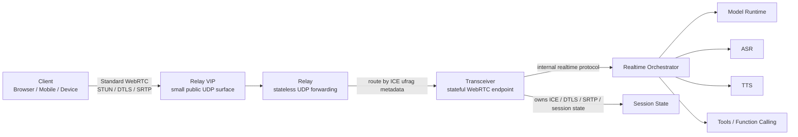
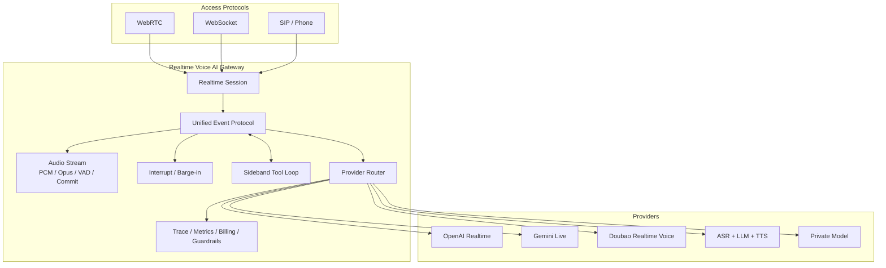

语音 AI 的体验门槛很高。

文本模型慢几百毫秒，用户通常还能接受；但语音对话慢几百毫秒，就会立刻变成“不自然”。停顿、打断失败、模型抢话、用户说完后迟迟没有回应，都会让产品从“像真人对话”退化成“按键上传音频”。

OpenAI 在《如何大规模提供低延迟语音 AI》一文中，公开介绍了他们为 ChatGPT Voice 和 Realtime API 重构 WebRTC 栈的思路。核心不是“再做一个 SFU”，而是把实时语音 AI 的接入链路拆成 `relay + transceiver`：对客户端保持标准 WebRTC，对内部则转换成更适合模型推理和编排的协议。

这篇文章尝试从工程视角拆解这套架构，以及它对实时语音 AI 网关的启发。

## 1. 为什么语音 AI 需要 WebRTC

WebRTC 最早常被理解为浏览器音视频通话技术，但对实时 AI 来说，它的价值不只是“传音频”。

它统一解决了几件很难绕开的底层问题：

- NAT 穿透和连接建立：ICE / STUN / TURN；
- 媒体安全传输：DTLS / SRTP；
- 编解码协商：音频、视频格式能力协商；
- 网络质量反馈：RTCP、丢包、抖动、延迟；
- 客户端音频体验：回声消除、降噪、抖动缓冲等。

对 AI 语音产品来说，最重要的是：音频可以连续流式到达模型侧。模型不必等用户完整上传一段录音后再处理，而是可以在用户讲话过程中同步做转写、理解、工具调用和语音生成。

这就是“实时对话”和“录音上传”的本质差异。

## 2. SFU 路线和 Transceiver 路线

传统 RTC 系统里，SFU 是非常自然的架构选择。

SFU 负责接收多个参与者的音视频流，并按需转发给其他参与者。它很适合会议、课堂、连麦、多人协作、人工接管等场景。系统主语义是：

```text
Room / Participant / Track / Publish / Subscribe
```

如果 AI 只是房间里的一个参与者，SFU 方案也能工作。比如 AI bot 加入房间，订阅用户音频，再发布自己的音频。

但 OpenAI 的场景不完全一样。大多数语音 AI 会话是 1:1：

```text
一个用户 <-> 一个模型
```

这类场景最敏感的不是多路媒体分发，而是低延迟、可打断、模型事件流、工具调用和会话状态。系统主语义更像：

```text
Session / User / Model / Event / Audio Delta / Interrupt / Tool
```

所以 OpenAI 选择了 transceiver 模型：边缘服务终止 WebRTC，把客户端音频和控制事件转换成内部模型协议，再接到推理、转写、TTS、工具编排等后端服务。

换句话说：

```text
SFU 解决多人如何在房间里交换媒体。
Transceiver 解决用户如何和模型进行实时语音交互。
```

两者不是谁替代谁，而是面向不同产品形态。

## 3. WebRTC 大规模部署的核心难点

OpenAI 文章里最有工程价值的部分，是他们没有停留在“WebRTC 很适合实时音频”，而是讲了大规模部署时的具体冲突。

第一个问题是 UDP 端口。

传统 WebRTC 服务常见做法是每个会话使用一个或一段 UDP 端口。小规模时可以接受，但大规模上 Kubernetes 和云负载均衡后，会遇到明显问题：

- 大量 UDP 端口难以暴露；
- 防火墙和安全策略复杂；
- 负载均衡器不适合管理巨大的端口范围；
- Pod 扩缩容和迁移时端口稳定性很难保证。

第二个问题是状态粘性。

即使改成“每台服务器一个 UDP 端口”，公共暴露面变小了，但 ICE、DTLS、SRTP 都是有状态协议。同一个会话的数据包必须持续回到拥有这个会话状态的进程，否则可能导致握手失败、媒体解密失败或者连接中断。

所以真正的问题变成：

```text
如何对公网只暴露少量稳定 UDP 入口，
同时把每个会话的数据包准确送到拥有该会话状态的 transceiver？
```

这就是 OpenAI `relay + transceiver` 架构要解决的问题。

## 4. Relay + Transceiver：拆分路由和协议终止

OpenAI 最终采用的架构是把媒体数据包路由和 WebRTC 协议终止拆开。



其中，`relay` 是轻量 UDP 转发层。它不解密媒体，不跑完整 ICE/DTLS 状态机，也不参与编解码协商。它只读取足够的包元数据，然后把包转发给正确的 transceiver。

`transceiver` 才是真正的 WebRTC 终止点。它拥有 ICE、DTLS、SRTP、会话生命周期等状态。对客户端来说，WebRTC 行为仍然是标准的；变化发生在 OpenAI 内部的数据包路由方式上。

这个设计的关键是首包路由。

在会话还没完全建立时，relay 就要知道第一个 STUN 包该发给哪个 transceiver。OpenAI 文章里提到，他们利用 ICE ufrag 这个协议原生字段携带路由元数据，让 relay 能够从首包中推断目标集群和拥有该会话的 transceiver。

这个点很漂亮：不是额外发明一套客户端协议，而是在标准 WebRTC 行为内嵌入内部路由所需的信息。

## 5. 对实时语音 AI 网关的启发

如果把实时交互平台拆开看，至少会出现两类路径。

第一类是房间路径：

```text
Client -> Room -> Participant -> Track -> SFU -> Subscribe
```

它服务多人实时互动，包括会议、课堂、连麦、人工接管、人机混合房间。这里继续使用 SFU 是合理的。

第二类是 AI 会话路径：

```text
Client -> Realtime Session -> Event Protocol -> Provider Gateway -> AI Model
```

它服务用户和 AI 模型的低延迟语音交互。这里的核心不是房间分发，而是实时模型会话：

- 音频流式输入；
- VAD 和 commit；
- 模型音频 / 文本 delta；
- 用户打断；
- 工具调用 sideband；
- provider fallback；
- latency trace；
- 多模型路由。

这条路径继续强行套 Room / Participant / Track 语义，会让产品定义和工程实现都变复杂。更合理的是把 WebRTC 当成一种外部实时接入协议，在边缘终止后转成内部统一的 realtime model protocol。

这也是实时语音 AI 网关应该承担的角色。

## 6. 实时语音 AI 网关不只是模型代理

传统 MaaS 主要代理文本模型 API：

```text
HTTP request / SSE stream / model id / token / billing
```

但实时语音 AI 网关代理的是实时语音会话：

```text
WebRTC / WebSocket / SIP
Audio stream
VAD
Interrupt
Response audio delta
Transcript
Tool call
Provider routing
Fallback
Observability
```

所以它不是简单的“OpenAI key 转发器”，而是一层实时语音会话网关。

对上，它应该提供统一的 realtime session API。

对下，它可以接多种 provider：

```text
OpenAI Realtime
Gemini Live
豆包实时语音
ASR + LLM + TTS 组合链路
企业私有模型
```

不同 provider 的协议、音频格式、事件类型、延迟特征、计费方式都不同。实时语音 AI 网关的价值就是把这些差异收敛在网关层，让业务只关心会话语义。



## 7. 一个可落地的演进路线

比较现实的落地方式可以分四步。

第一阶段，选择一个完整的实时语音模型 API 作为 canonical provider。

它需要覆盖音频输入、音频输出、文本流、函数调用、打断等核心能力，适合作为内部 realtime event protocol 的参照物。

第二阶段，支持组合型 provider。

不是所有厂商都会提供端到端 speech-to-speech 模型。很多场景会是：

```text
ASR -> LLM -> TTS
```

网关需要把这条组合链路包装成同一个 realtime session，让业务侧不感知底层是原生语音模型还是三段式管线。

第三阶段，做多 provider router。

根据语言、区域、成本、延迟、稳定性、模型能力、额度状态选择 provider。例如：

```text
低延迟口语对话 -> 原生 Realtime 语音模型
中文客服降本 -> ASR + 文本模型 + TTS
复杂推理 -> 高推理能力文本模型 + TTS
国内合规部署 -> 国产 provider / 私有模型
```

第四阶段，补企业级能力。

包括鉴权、租户、限流、计费、审计、trace、质量监控、灰度、fallback、成本保护和 SLA。这些才是网关服务真正商业化的部分。

## 8. 结论

OpenAI 的这篇文章真正说明了一件事：实时语音 AI 的基础设施，不只是把音频送进模型那么简单。

当规模上来后，问题会集中在：

```text
接入协议
媒体终止
会话归属
UDP 路由
低延迟
打断
模型事件流
多 provider 编排
可观测性
```

SFU 仍然适合多人实时互动，但 AI-native 语音会话需要另一条路径。更合理的架构，是同时保留：

```text
Room Path
AI Session Path
```

前者承载多人音视频，后者承载用户与模型的实时语音交互。

从这个角度看，OpenAI 的 `relay + transceiver` 并不是一个孤立的 WebRTC 优化，而是实时 AI 基础设施向“语音会话网关”演进的信号。

未来的竞争点也不会只是“谁接了更多模型”，而是谁能把多 provider、低延迟、可打断、可观测、可 fallback 的实时语音会话做成稳定服务。

这就是实时语音 AI 网关的机会。

## 参考资料

- [OpenAI：如何大规模提供低延迟语音 AI](https://openai.com/zh-Hans-CN/index/delivering-low-latency-voice-ai-at-scale/)
- [OpenAI Realtime API Overview](https://platform.openai.com/docs/guides/realtime/overview)
